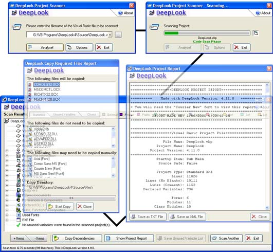

<div align="center">

## DeepLook 4\.12 \(UPDATED 26th Sep 2006\)


</div>

### Description

Yes, it's back; yet another version of my award-winning VB source code scanning program. For those who don't know, DeepLook can scan your VB projects and return a detailed treeview showing statistics on almost every aspect. Other functions include the ability to copy all the files required by yor project into a single directory, create HTML/TXT reports and report unused variables. Incorporating many new bug-fixes and features, this release includes a feature that many users have requested even since its conception: HTML reports. After beginning the HTML template code, I got frustrated with the clumsyness of the method I was using so decided to use XML reports instead with a HTML formatting template. The result is that a XML report is saved as two files, the actual XML report data and a XML stylesheet (which, incidentally, is a Microsoft template that I altered to suit DeepLook). This method means smaller and faster XML report saving code. In case you already have a DeepLook text report saved on your computer, you can now "scan" the text file to produce a XML report directly. Other additions include making the code MUCH more robust as well as fixing what I think I can safely say all the remaining bugs in the Unused Variable Scanner. The UVS also takes into account (ignores) case-preserving variables that are encapsulated in the "#if false" and "#end if" headers. Other new additions/corrections are listed below. Screenshot note: the daughter windows are NOT transparent in the actual program, that just saves space. No votes please, this is just an update (and i've already won once!) but I WOULD appreciate some constructive comments. Zip ~350kb. +++ MAJOR ADDITIONS IN THIS VERSION: Array handling fixed for a major speed increase, Quick access Addin

This contains a few bugfixes I implemented since the major Nov update. Fixed bugs described by Lorin, Morgan and Robert in the comments, as well as a bug I found in the Recent Scanned Items list.

### UPDATE: Fixed an issue which may cause an infinite loop or incorrect results, thanks to Steve Redmyer###
 
### More Info
 
* New Copy Required Files XML reports generated with file copy

* "Show All" menu item disabled if "Allow only one open Treeview Branch at a time" set

* Graphics update - new header and some treeview/list images

* Analyse button no longer enabled when Clear Recent Scan list item selected

* Is System DLL function rewritten, system DLL names are now stored in a string table in the

RES file (IDs 100+)

* Re-wrote Malicious code scanner to fix a flaw, keywords now stored in RES file string table

also (IDs 200+)

* Fixed small bug in my 3D line control

* Arrays instead of hidden listboxes used to store Potentially Malicious Code and Used Fonts

* Substituted arrays with index variables instead of collections - MUCH faster now

* New option to bring the currently scanned file to the top of the recent scanned files list

* Fixed bug in "CheckIsFunction" where static/friend function names were prefixed by "Function"

on the treeview

* Added very simple bubble sort algorithm to sort potentially malicious code, SPFs and used

fonts alphabetically

* Bug in the UVS CheckIsProperty routine fixed (test against incorrect variable stopped

property recognition)

* Added option to alphabetically sort Subs, Functions and properties in the treeview

* Malicious keywords are read out of the string table into a buffer array for speed when scan begins

* Expand Ref/Com menu item now expands CreateObject statements too

* Fixed bug where VBP project filenames were clipped in the copy files treeview

* SPF pie chart now shows the fraction of blank lines correctly

* Unused Variable Scanner now ignores variables that are commented out (both declarations and use)

* Fixed bug where UVS not scanning projects in a project group file

* Changed the XML parser engine to locate the tables correctly, for some reason it failed on

group projects

* .NET projects now show a "not avaliable" message on the XML page

* Badly modified progressbar so that both the project and project group scan progress can be shown

on the same progressbar

* Replaced two variants with string arrays for speed

* (Non-code) Directory structure of project files changed to a more orderly system

* (Non-code) DeepLook FAQ added

* Quick-scan DeepLook VB6 addin created

* Fixed bug where all DLLs recognised as system (I forgot that StrComp returns 0 if identical, not 1)

* User can now optionally skip the copying of project dependancies via checkboxes for each item


<span>             |<span>
---                |---
**Submitted On**   |2006-09-23 11:12:10
**By**             |[Dean Camera](https://github.com/Planet-Source-Code/PSCIndex/blob/master/ByAuthor/dean-camera.md)
**Level**          |Intermediate
**User Rating**    |4.9 (291 globes from 59 users)
**Compatibility**  |VB 6\.0
**Category**       |[Complete Applications](https://github.com/Planet-Source-Code/PSCIndex/blob/master/ByCategory/complete-applications__1-27.md)
**World**          |[Visual Basic](https://github.com/Planet-Source-Code/PSCIndex/blob/master/ByWorld/visual-basic.md)
**Archive File**   |[DeepLook\_42021799252006\.zip](https://github.com/Planet-Source-Code/dean-camera-deeplook-4-12-updated-26th-sep-2006__1-60867/archive/master.zip)

### API Declarations

```
Works best when compiled - 940kb, or ~220kb when compressed with the UPX (upx.sourceforge.net) EXE compressor or FSG EXE packer.
Currently scans at about 1500 lines per second on a 700MHz computer.
```


